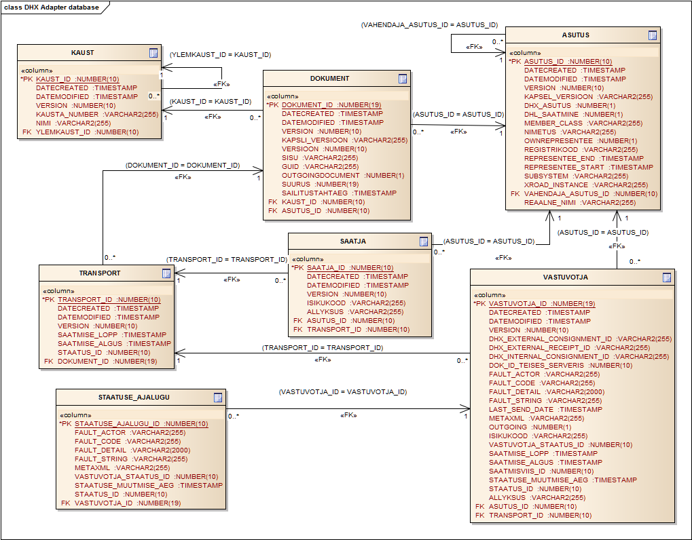

# DHX adapterserveri haldusjuhend

  

## 1. Sissejuhatus

DHX adapterserver on tarkvara, mis hõlbustab [DHX](https://e-gov.github.io/DHX/) dokumendivahetuse protokolli kasutusele võtmist.

DHX adapterserveri toimimise loogika on kirjeldatud [DHX adapterserveri kasutusjuhendis](adapter-server-kasutusjuhend.md).

DHX adapterserveri paigaldamine on kirjeldatud [DHX adapterserveri paigaldusjuhendis](adapter-server-paigaldusjuhend.md).

DHX adapterserver on iseseisvalt toimiv komponent, mis üldjuhul ei vaja pidevat jälgmist. 

DHX adapterserver võtab dokumendi edastamiseks vastu, salvestades selle metaandmed andmebaasi ja binaarfaile sisaldava Kapsli XML-i lokaalsese failisüsteemi.
Pärast seda kui dokument on DHX kaudu edastatud või sisemise liidese kaudu alla laetud, võib selle DHX adapterserveri andmebaasist ja failisüsteemist kustutada. 
Kustutamist teostab perioodilne taustatöö.   

Halduse tegevused võib jaotada kaheks:
* Serveri ressursside (mälu ja kettamaht) kasutuse jälgimine. 
* Dokumentide edastamise vigade põhjuste analüüsimine.    

## Monitooring

### Monitooringu liidesed

### DHX adapterserveri staatus (Health)
DHX adapterserver pakub andmebaasi ühenduste staatuse ja JAva poolt kasutatava muutmälu jälgimiseks lihtsat liidest aadressil: 

http://localhost:8080/dhx-adapter-server/health

See tagastab JSON formaadis vastus:
```json
{
 "status":"UP",
 "diskSpace":{
    "status":"UP",
    "total":486358904832,
    "free":57804505088,
    "threshold":10485760
 },
 "db":{
   "status":"UP",
   "database":"Oracle",
   "hello":"Hello"
  }
}
```

### DHX adapterserveri mõõdikud (Metrics)

Pisut parem ülevaate serveri tööst annab mõõdikute päring, mis tagastab kummulatiivsed serveri kasutuse näitajad (pärast viimast restarti).  

http://localhost:8080/dhx-adapter-server/metrics

Vastuse näide:
```json
{
	"mem":2121497,
	"mem.free":1638207,
	"processors":8,
	"instance.uptime":32055612,
	"uptime":32080833,
	"systemload.average":-1.0,
	"heap.committed":2000384,
	"heap.init":2072576,
	"heap.used":362176,
	"heap":2000384,
	"nonheap.committed":122904,
	"nonheap.init":2496,
	"nonheap.used":121113,
	"nonheap":0,
	"threads.peak":26,
	"threads.daemon":23,
	"threads.totalStarted":30,
	"threads":25,
	"classes":13739,
	"classes.loaded":13739,
	"classes.unloaded":0,
	"gc.ps_scavenge.count":7,
	"gc.ps_scavenge.time":265,
	"gc.ps_marksweep.count":3,
	"gc.ps_marksweep.time":324,
	"gauge.response.wsServer":766.0,
	"gauge.response.health":671.0,
	"gauge.response.wsServer.dhl.wsdl":131.0,
	"gauge.response.ws":24860.0,
	"gauge.response.unmapped":7.0,
	"counter.status.500.unmapped":12,
	"counter.status.200.wsServer":10,
	"counter.status.200.health":2,
	"counter.status.400.unmapped":24,
	"counter.status.200.ws":12,
	"counter.status.200.wsServer.dhl.wsdl":2
}
```

### Tomcat JMX liides

https://tomcat.apache.org/tomcat-8.0-doc/monitoring.html

### Logimine

## Edastamise vigade uurimimine

Kõige lihtsam on alustada uurimist andmebaasist. Andmebaasi mudel on järgmine:



Tabelite kirjeldused:
* DOKUMENT - sisaldab dokumendi andmeid. Väljal SISU salvestatakse faili nimi (c:\dhs_docs\ kataloogis).
* 