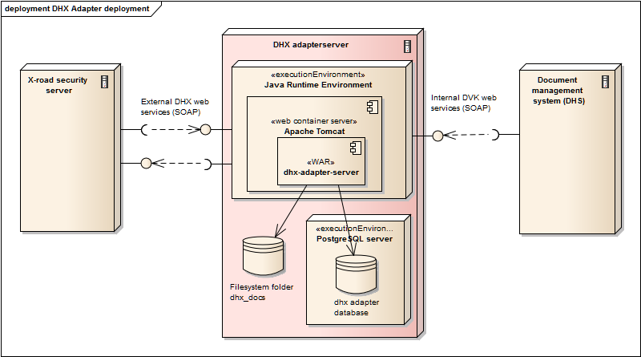
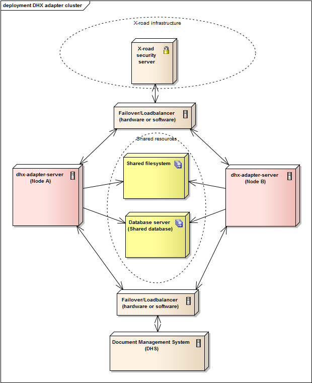
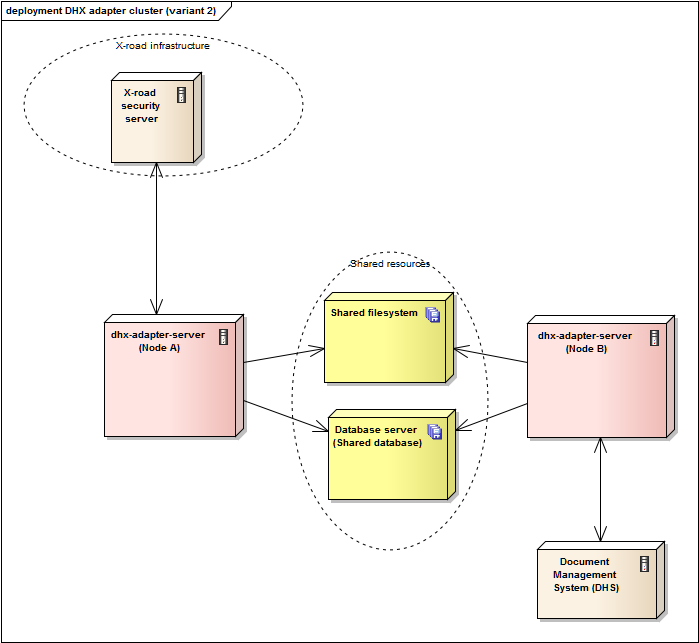

# DHX adapterserveri paigaldusjuhend

  

Sisukord
=================

  * [DHX adapterserveri paigaldusjuhend](#dhx-adapterserveri-paigaldusjuhend)
    * [1\. Sissejuhatus](#1-sissejuhatus)
    * [2\. Tarkvara nõuded (baastarkvara eeldused)](#2-tarkvara-n%C3%B5uded-baastarkvara-eeldused)
    * [3\. Riistvara nõuded (eeldused)](#3-riistvara-n%C3%B5uded-eeldused)
    * [4\. Paigaldamine](#4-paigaldamine)
      * [4\.1\. Olemasoleva paigalduspaketiga (WAR) \- Tomcat ja PostgeSQL](#41-olemasoleva-paigalduspaketiga-war---tomcat-ja-postgesql)
        * [4\.1\.1\. PostgreSQL 9\.6](#411-postgresql-96)
        * [4\.1\.2 Java 8 SE](#412-java-8-se)
        * [4\.1\.3\. Apache Tomcat 7](#413-apache-tomcat-7)
        * [4\.1\.4\. DHX adapterserver WAR](#414-dhx-adapterserver-war)
        * [4\.1\.5\. Muuta dhx\-application\.properties](#415-muuta-dhx-applicationproperties)
        * [4\.1\.6\. Paigaldada Tomcat Windows Servicena või Linux deemonina\.](#416-paigaldada-tomcat-windows-servicena-v%C3%B5i-linux-deemonina)
      * [4\.2\. Olemasoleva paigalduspaketiga (WAR) \- Tomcat ja Oracle 11g Express edition](#42-olemasoleva-paigalduspaketiga-war---tomcat-ja-oracle-11g-express-edition)
        * [4\.2\.1\. Oracle 11g Express Edition](#421-oracle-11g-express-edition)
        * [4\.2\.2\. Java 8 SE](#422-java-8-se)
        * [4\.2\.3\. Apache Tomcat 7](#423-apache-tomcat-7)
        * [4\.2\.4\. DHX adapterserver WAR](#424-dhx-adapterserver-war)
        * [4\.2\.5\. Muuta dhx\-application\.properties](#425-muuta-dhx-applicationproperties)
        * [4\.2\.6\. Paigaldada Tomcat Windows Servicena või Linux deemonina\.](#426-paigaldada-tomcat-windows-servicena-v%C3%B5i-linux-deemonina)
      * [4\.3\. Paigalduspaketi ise ehitamine](#43-paigalduspaketi-ise-ehitamine)
        * [4\.3\.1\. Installeerida Apache Maven ehitustarkvara](#431-installeerida-apache-maven-ehitustarkvara)
        * [4\.3\.2\. Laadida alla Oracle JDBC draiver (ojdbc6\.jar)](#432-laadida-alla-oracle-jdbc-draiver-ojdbc6jar)
        * [4\.3\.3\. Paigaldada ojdbc6\.jar lokaalsesse Maven reposse](#433-paigaldada-ojdbc6jar-lokaalsesse-maven-reposse)
        * [4\.3\.4\. Laadida alla DHX\-adapter lähtekood](#434-laadida-alla-dhx-adapter-l%C3%A4htekood)
        * [4\.3\.5\. Kompilleerida lähtekood Maven\-iga](#435-kompilleerida-l%C3%A4htekood-maven-iga)
        * [4\.3\.6\. Paigaldada WAR fail](#436-paigaldada-war-fail)
    * [5\. DHX teenuste registreerimine ja avamine X-tee turvaserveris](#5-dhx-teenuste-registreerimine-ja-avamine-x-tee-turvaserveris)
    * [6\. Häälestus fail (dhx\-application\.properties)](#6-h%C3%A4%C3%A4lestus-fail-dhx-applicationproperties)
    * [7\. Klastrisse paigaldamine (Failover/Load balancing)](#7-klastrisse-paigaldamine-failoverload-balancing)
    * [8\. Teadaolevad probleemid (sõltuvuste konfliktid)](#8-teadaolevad-probleemid-s%C3%B5ltuvuste-konfliktid)
    * [9\. Paigalduse testimine (SoapUI)](#9-paigalduse-testimine-soapui)

## 1. Sissejuhatus

DHX adapterserver on tarkvara, mis hõlbustab [DHX](https://e-gov.github.io/DHX/) dokumendivahetuse protokolli kasutusele võtmist.

DHX adapterserveri toimimise loogika on kirjeldatud [DHX adapterserveri kasutusjuhendis](adapter-server-kasutusjuhend.md).

DHX adapterserveri haldamine on kirjeldatud [DHX adapterserveri haldusjuhendis](adapter-server-haldusjuhend.md).

Minimaalne (kõik komponendid ühes serveris) paigalduse vaade on järgmine



## 2. Tarkvara nõuded (baastarkvara eeldused)

* **Java SE 8** või **Java SE 7**. Käivitamiseks on vajalik [Java SE 7](http://www.oracle.com/technetwork/java/javase/downloads/index.html) (või uuem) versioon.
* **Apache Tomcat 7**. Tarkvara käivitamiseks on vajalik [Apache Tomcat 7](http://tomcat.apache.org/download-70.cgi) või uuem versioon.
* **PostgreSQL 9.6** või **Oracle 11g**. Andmebaasi serverina on soovituslik kasutada [PostgreSQL 9.6](https://www.postgresql.org/) või [Oracle 11g](http://www.oracle.com/technetwork/database/index.html) (kaasa arvatud 11g Express Edition) või uuemaid versioone.
* Operatsioonisüsteem - Java poolt [toetatud süsteem](https://www.java.com/en/download/help/sysreq.xml).

Märkus (muud andmebaasid):
> Tõenäoliselt toimib tarkvara ka muude [Hibernate ORM](http://hibernate.org/orm/documentation/5.0/) poolt toetatud SQL andmebaasi [serveritel](https://docs.jboss.org/hibernate/orm/5.0/manual/en-US/html/ch03.html#configuration-optional-dialects), nagu [MySQL](https://www.mysql.com/) ja [Microsoft SQL Server](https://www.microsoft.com/en-us/sql-server/).
>
> **NB!** DHX adapterserveri töötamine on testitud ainult [PostgreSQL 9.6](https://www.postgresql.org/) ja [Oracle 11g](http://www.oracle.com/technetwork/database/index.html) andmebaasi serveri versioonidega.
>
> Seega muude andmebaasi serverite kasutamine toimub omal riisikol ja ei pruugi töötada.
>
> Paigalduspaketina alla laetav WAR fail sisaldab ainult PostgreSQL ja Oracle andmebaasiga suhtlemise [JDBC](https://en.wikipedia.org/wiki/Java_Database_Connectivity) draivereid. Kui soovitakse kasutatakse muud andmebaasi, siis tuleb dhx-adapter-serveri WAR fail [ise uuesti ehitada](#43-paigalduspaketi-ise-ehitamine), muutes [pom.xml](../dhx-adapter-server/pom.xml) failis sõltuvusi. 

Märkus (muud Java web serverid):
> Apache Tomcat tarkvara võib asendada mõne muu [Java Web konteiner](https://en.wikipedia.org/wiki/Web_container) tarkvaraga. 
> Näiteks [GlassFish](https://glassfish.java.net/),  [WildFly (JBoss)](http://wildfly.org/) või [Jetty](http://www.eclipse.org/jetty/).
>
> Paigalduspaketina alla laetav WAR fail sisaldab ainult Apache Tomcat serverisse paigaldamise `spring-boot-starter` [mooduleid](https://spring.io/blog/2014/03/07/deploying-spring-boot-applications). Kui soovitakse kasutatakse muud Java serverit, siis tuleb dhx-adapter-serveri WAR fail ise uuesti ehitada, muutes `pom.xml` failis sõltuvusi.

## 3. Riistvara nõuded (eeldused)
 
Minimaalsed nõuded riistvarale on järgmised:
* Muutmälu 2GB
* Kõvaketas 70 Gb
* Protsessor 2 GHz x 2 tuuma
* Võrgukaart 100 Mbps

Optimaalsed riistvara nõuded sõltuvad asutuse poolt saadetavate dokumentide arvust ja suurusest. 
Samuti sellest kas andmebaasi server paigaldatakse samasse masinasse või eraldi. **Soovitav on minimaalsed nõuded kahega korrutada**. 

## 4. Paigaldamine

### 4.1. Olemasoleva paigalduspaketiga (WAR) - Tomcat ja PostgeSQL

#### 4.1.1. PostgreSQL 9.6

Laadida alla ja installeerida PostgreSQL andmebaasi versioon [9.6.x](https://www.postgresql.org/download/).

#### 4.1.2 Java 8 SE

Laadida alla ja installeerida [Java 8 SE Runtime environment](http://www.oracle.com/technetwork/java/javase/downloads/jre8-downloads-2133155.html).


#### 4.1.3. Apache Tomcat 7

1) Laadida alla ja installeerida (pakkida lahti) [Apache Tomcat 7](https://tomcat.apache.org/download-70.cgi) või uuem versioon.


2) Tekitada kataloogi  `apache-tomcat-7.x.x/bin` uus fail nimega `setenv.bat` (Windows) või `setenv.sh` (Linux/Unix).

Lisada sellesse faili allolevad read.

Windows:
```bat
set JRE_HOME="C:\Program Files\Java\jre1.8.0_112"
set CATALINA_OPTS=-Xms2048m -Xmx2048m -Djava.awt.headless=true -server
exit /b 0
```

Linux/Unix:
```sh
JRE_HOME=/usr/java/latest
CATALINA_OPTS="-Xms2048m -Xmx2048m -Djava.awt.headless=true -server"
CATALINA_PID="$CATALINA_BASE/tomcat.pid"
```

Märkus (JRE_HOME):
> Näites toodud JRE_HOME kataloogitee (`C:\Program Files\Java\jre1.8.0_112` või `/usr/java/latest`) asendada vastavalt enda installatsioonile.

Märkus (Java mälu suurus):
> CATALINA_OPTS parameetris määratakse Tomcat Java protsessi poolt kasutatava mälu suurus.
> 
> Kui kasutatakse minimaalset riistvaralist häälestust (masinas muutmälu 2Gb), siis võiks see olla 1Gb ehk `-Xms1024m -Xmx1024m`
> 
> Kui kasutatakse optimaalsemat riistvaralist häälestust (masinas muutmälu 4Gb-8Gb), siis võiks see olla 2Gb kuni 4Gb ehk `-Xms2048m -Xmx2048m` või `-Xms4096m -Xmx4096m`


3) Soovi korral muuta ümber Tomcat TCP/IP pordi number (vaikimisi 8080) failis `apache-tomcat-7.x.x/conf/server.xml`.
```xml
    <Connector port="8080" protocol="HTTP/1.1"
               connectionTimeout="20000"
               redirectPort="8443" />
```

4) Käivitada Tomcat skriptiga `apache-tomcat-7.x.x/bin/startup.bat` (windows) või `apache-tomcat-7.x.x/bin/startup.sh` (Linux/Unix).

#### 4.1.4. DHX adapterserver WAR

1) Laadida alla DHX adapterserveri WAR fail `dhx-adapter-server.war`.

2) Kopeerida see Tomcat `apache-tomcat-7.x.x/webapps` alamkataloogi
(Näiteks Windows keskkonnas `C:\Program Files\apache-tomcat-7.0.73\webapps\` alamkataloogi).

3) Tomcat püüab seejärel automaatselt WAR faili avada ja paigaldada (deploy).

4) Tekib uus alamkataloog `webapps/dhx-adapter-server`.
Aga kuna WAR fail sisaldab valesid andmebaasi ühenduse parameetreid, siis Tomcat konsoolile/logisse kuvatakse viga.

#### 4.1.5. Muuta dhx-application.properties

1) Avada fail `webapps/dhx-adapter-server/WEB-INF/classes/dhx-application.properties` ja muuta seal õigeks andmebaasi ühenduse, X-tee turvaserveri ja asutuse registrikoodi parameetrid

```properites
soap.security-server=http://10.0.13.198
soap.xroad-instance=ee-dev
soap.member-class=GOV
soap.member-code=40000001

documents.folder=C:\\dhx_docs\\

spring.datasource.url=jdbc:postgresql://localhost:5432/dhx_adapter_dev
spring.datasource.username=postgres
spring.datasource.password=123456
spring.datasource.driver-class-name=org.postgresql.Driver
spring.jpa.properties.hibernate.dialect = org.hibernate.dialect.PostgreSQL94Dialect
```
Teha muudetud `dhx-application.properties` failist backup koopia kuhugi mujale kataloogi.

2) Luua ülaltoodud kataloog `C:\dhx_docs\` (Windows) või `/dhs_docs` (Linux/Unix) ja kontrollida kas Tomcat protsessi käivitaval kasutajal on seal kirjutamise õigused.   

3) Teha Tomcati restart.

Stop `apache-tomcat-7.x.x/bin/shutdown.bat` (windows) või `apache-tomcat-7.x.x/bin/shutdown.sh` (Linux/Unix).

Start `apache-tomcat-7.x.x/bin/startup.bat` (windows) või `apache-tomcat-7.x.x/bin/startup.sh` (Linux/Unix).

Märkus:
> Andmebaasi ühenduse esmakordsel avamisel kontrollitakse kas vajalikud andmebaasi tabelid on juba olemas. 
> Kui tabeleid ei ole, siis luuakse need automaatselt (eraldi SQL skriptiga ei ole vaja andmebaasi tabeleid luua)
>
> Selle määrab `dhx-application.properties` failis parameeter `spring.jpa.hibernate.ddl-auto=update` .
> Vaata [Spring boot juhendist](https://docs.spring.io/spring-boot/docs/current/reference/html/howto-database-initialization.html#howto-initialize-a-database-using-hibernate).

4) Vaadata kas Tomcat konsoolis või logis esineb veel vigu (ei tohiks esineda)

#### 4.1.6. Paigaldada Tomcat Windows Servicena või Linux deemonina. 

Selleks saab kasutada skripti `apache-tomcat-7.x.x/bin/service.bat` (Windows) või `apache-tomcat-7.x.x/bin/daemon.sh` (Linux/Unix).

Näiteks käivitades käsurealt: `service.bat install`

Vaata täpsemalt [Tomcat Windows service HOW-TO](https://tomcat.apache.org/tomcat-7.0-doc/windows-service-howto.html).


### 4.2. Olemasoleva paigalduspaketiga (WAR) - Tomcat ja Oracle 11g Express edition

#### 4.2.1. Oracle 11g Express Edition

1) Laadida alla ja installeerida [Oracle 11g XE](http://www.oracle.com/technetwork/database/database-technologies/express-edition/downloads/index.html).

2) Logida oracle andmebaasi SYS kasutaja ja luua uus kasutaja (schema):
```sql
create user dhxadapter
  identified by dhxadapter123
  DEFAULT TABLESPACE USERS;

grant connect to dhxadapter;
grant resource to dhxadapter;
grant unlimited tablespace to dhxadapter;
```

#### 4.2.2. Java 8 SE

Vaata [eespoolt](#412-java-8-se)


#### 4.2.3. Apache Tomcat 7

Vaata [eespoolt](#413-apache-tomcat-7) 

#### 4.2.4. DHX adapterserver WAR

Vaata [eespoolt](#414-dhx-adapterserver-war) 

#### 4.2.5. Muuta dhx-application.properties

1) Avada fail `webapps/dhx-adapter-server/WEB-INF/classes/dhx-application.properties` ja muuta seal õigeks andmebaasi ühenduse, X-tee turvaserveri ja asutuse registrikoodi parameetrid

```properites
soap.security-server=http://10.0.13.198
soap.xroad-instance=ee-dev
soap.member-class=GOV
soap.member-code=40000001

documents.folder=C:\\dhx_docs\\

spring.datasource.url=jdbc:oracle:thin:dhxadapter/dhxadapter123@localhost:1521:xe
spring.jpa.database-platform=org.hibernate.dialect.Oracle10gDialect
spring.datasource.driver-class-name=oracle.jdbc.OracleDriver
spring.datasource.type=oracle.jdbc.pool.OracleDataSource
```
Teha muudetud `dhx-application.properties` failist backup koopia kuhugi mujale kataloogi.

2) Luua ülaltoodud kataloog `C:\dhx_docs\` (Windows) või `/dhs_docs` (Linux/Unix) ja kontrollida kas Tomcat protsessi käivitaval kasutajal on seal kirjutamise õigused.

3) Teha Tomcati restart.

Stop `apache-tomcat-7.x.x/bin/shutdown.bat` (windows) või `apache-tomcat-7.x.x/bin/shutdown.sh` (Linux/Unix).

Start `apache-tomcat-7.x.x/bin/startup.bat` (windows) või `apache-tomcat-7.x.x/bin/startup.sh` (Linux/Unix).

4) Vaadata kas Tomcat konsoolis või logis esineb veel vigu (ei tohiks esineda)

#### 4.2.6. Paigaldada Tomcat Windows Servicena või Linux deemonina.

Vaata [eespoolt](#416-paigaldada-tomcat-windows-servicena-või-linux-deemonina) 

### 4.3. Paigalduspaketi ise ehitamine

Kui soovitakse tarkvara paigalda mingisse muuse Java Web serverisse (mitte Tomcat) või kasutada muud andmebaasi serverit (mitte PostgreSQL ega Oracle), siis tuleb WAR fail ise uuesti ehitada, muutes eelnevalt `/DHX-adapter/dhx-adapter-server/pom.xml` failis sõltuvusi.

Kui soovitakse paigaldada Java Servlet spetsifikatsiooni [3.0](http://download.oracle.com/otndocs/jcp/servlet-3.0-fr-oth-JSpec/) või uuemat versiooni toetavasse Java Web Konteinerisse, mis toetavad annotatsioone, siis piisab Spring-boot-starter'ite häälestamisesest [pom.xml](../dhx-adapter-server/pom.xml) sees (vaikimisi on seal `spring-boot-starter-web`, `spring-boot-starter-tomcat`, `spring-boot-starter-data-jpa`).  

Vaata [Spring juhendist](http://docs.spring.io/spring-boot/docs/current/reference/html/howto-traditional-deployment.html).

Kui soovitakse paigaldada vanemasse Java Web Konteinerisse, siis tuleb häälestus teha [Web.xml](http://docs.spring.io/spring-boot/docs/current/reference/html/howto-traditional-deployment.html#howto-create-a-deployable-war-file-for-older-containers) kaudu.
Selleks koha vaata täpsemalt [DHX Java teegi kasutusjuhend](java-teegid-kasutusjuhend.md#teegi-laadimise-h%C3%A4%C3%A4lestamine-webxml-ja-applicationcontextxml).

#### 4.3.1. Installeerida Apache Maven ehitustarkvara

1) Laadida alla ja installeerida [Java Development Kit](http://www.oracle.com/technetwork/java/javase/downloads/index.html) (JDK) 7 või 8 või uuem.

Märkus:
> Ainult Java Runtime Environment (JRE) ei ole piisav Maveni kasutamiseks.  

Pärast installeerimist veenduda et keskkonna muutuja JAVA_HOME viitab õigesse JDK kataloogi (näiteks `C:\Program Files\Java\jdk1.8.0_121`).

Käsurealt saab seda kontrollida käsuga `echo %JAVA_HOME%` (Windows) või `echo $JAVA_HOME` (Linux/Unix). 

Kui ei viita, siis paranda JAVA_HOME.

2) Laadida alla [Apache Maven](https://maven.apache.org/download.cgi). 

3) Pakkida see lahti, näiteks kataloogi `C:\Program Files`, nii et tekib kataloog `C:\Program Files\apache-maven-3.3.9\`

4) Lisada tekkinud kataloogi "bin" alamakataloog (näiteks `C:\Program Files\apache-maven-3.3.9\bin`) PATH keskkonna muutujasse.
Alternatiiv on kasutada "mvn.cmd" (Windows) või "mvn" (Linux shell) skripte täispika kataloogi teega.

#### 4.3.2. Laadida alla Oracle JDBC draiver (ojdbc6.jar)

Laadida alla Oracle JDBC draiver [ojdbc6.jar](http://www.oracle.com/technetwork/apps-tech/jdbc-112010-090769.html) (nõuab registreerimist ja sisselogimist).

Märkus:
> Oracle ei ole soovinud ise oma JDBC draiverite JAR faile Central Maven reposse üles laadida, seepärast peab selle käsitsi alla laadima ja Maven lokaalsesse REPOsse paigaldama.

Alternatiiviks on laadida ojdbc6.jar vanem versioon alla [siit](https://code.lds.org/nexus/content/groups/main-repo/com/oracle/ojdbc6/).

Alternatiiviks (kui ei kasututa Oracle andmebaasi) on [/DHX-adapter/dhx-adapter-server/pom.xml](../dhx-adapter-server/pom.xml) seest eemaldada read:
```xml
		<dependency>
			<groupId>com.oracle</groupId>
			<artifactId>ojdbc6</artifactId>
			<version>11.2.0.4</version>
		</dependency>
```

#### 4.3.3. Paigaldada ojdbc6.jar lokaalsesse Maven reposse

Selleks minna kataloogi kuhu ojdbc6.jar alla laeti, näiteks:
```cmd
cd C:\Users\kasutaja\Downloads 
```

Käivitada seal Maven käsk:
```cmd
mvn install:install-file -Dfile=ojdbc6.jar -DgroupId=com.oracle -DartifactId=ojdbc6 -Dversion=11.2.0.4 -Dpackaging=jar
```

#### 4.3.4. Laadida alla DHX-adapter lähtekood

Laadida alla ("download" või "git clone") DHX-adapter [lähtekood](https://github.com/e-gov/DHX-adapter).


#### 4.3.5. Kompilleerida lähtekood Maven-iga

1) Käsurealt minna lähtekoodi kataloogi. Näiteks:
```cmd
cd C:\Users\kasutaja\git\DHX-adapter
```

2) Käivitada Maven ehitamine

```cmd
mvn clean install
```

Selle väljundiks peaks olema SUCCESS:
```
[INFO] Reactor Summary:
[INFO]
[INFO] DHX-adapter ....................................... SUCCESS [2.903s]
[INFO] dhx-adapter-core .................................. SUCCESS [10.183s]
[INFO] Web services ...................................... SUCCESS [35.038s]
[INFO] dhx-adapter-server ................................ SUCCESS [1:13.734s]
[INFO] ------------------------------------------------------------------------
[INFO] BUILD SUCCESS
[INFO] ------------------------------------------------------------------------
```

Kompileeritud JAR failid tekivad Maven lokaalsesse reposse kataloogi `C:\Users\kasutaja\.m2\repository\ee\ria\dhx` (Windows) või   `/home/kasutaja/.m2/repository/ee/ria/dhx` (Linux/Unix).

#### 4.3.6. Paigaldada WAR fail

1) Võtta Maven lokaalsest repost ( `kasutaja/.m2/repository/ee/ria/dhx/dhx-adapter-server/1.0.0`) tekkinud fail `dhx-adapter-server-1.0.0.war` 
ja nimetada see ümber `dhx-adapter-server.war`.

2) Teostada WAR paigaldamine Web Konteiner (Tomcat) serverisse. Vaata [eespool](#41-olemasoleva-paigalduspaketiga-war---tomcat-ja-postgesql).
 


## 5. DHX teenuste registreerimine ja avamine X-tee turvaserveris    

Järgnevalt eeldatakse, et asutus on X-tee liikmeks registreerunud, paigaldanud X-tee turvaserveri ja registreerinud enda [DHX*](https://e-gov.github.io/DHX/#55-reserveeritud-nimi-dhx) alamsüsteemi(d) [RIHAs](https://riha.eesti.ee/riha/main). 
Selle kohta vaata täpsemalt [X-tee rakendusjuhendist](https://moodle.ria.ee/mod/page/view.php?id=288).

**1)** Lisada turvaserveris uus klient enda asutuse DHX alamsüsteemile ja registreerida see (Turvaserveris menüü `Configuration`->`Security Server Clients`->`Add Client`). 

Vaata [X-tee turvaserveri kasutusjuhendist (PDF)](http://x-road.eu/docs/x-road_v6_security_server_user_guide.pdf) punkt "4.2. ADDING A SECURITY SERVER CLIENT".

**2)** Lisada DHX adapaterserveri välise DHX liidese WSDL ja teenuse URL uue turvaserveri kliendi juurde.

Vaata [X-tee turvaserveri kasutusjuhendist (PDF)](http://x-road.eu/docs/x-road_v6_security_server_user_guide.pdf) punktid "6.1. ADDING A WSDL" ja "6.6. CHANGING THE PARAMETERS OF A SERVICE".

Välise DHX liidese WSDL asub DHX adapterserveris üldjuhul aadressil `http://<HOST>:<PORT>/dhx-adapter-server/ws/dhx.wsdl`.

Välise DHX liidese teenuse URL (Service URL) asub DHX adapterserveris üldjuhul aadressil `http://<HOST>:<PORT>/dhx-adapter-server/ws`.

**2.1)** Turvaserveris valida menüü `Configuration`->`Security Server Clients` ja eelnevalt lisatud kliendi juures klikata "Services". 

**2.2)** Seejärel valida "Add WSDL" ja sisestada välise DHX liidese WSDL aadress (`http://<HOST>:<PORT>/dhx-adapter-server/ws/dhx.wsdl`, asendades `<HOST>` ja `<PORT>` enda DHX adapaterserveri väärtustega).

**2.3)** Seejärel valida tekkinud teenuse "sendDocument" peal "Edit" ja sisestada "Service URL" väärtuseks välise DHX liidese teenuse URL (`http://<HOST>:<PORT>/dhx-adapter-server/ws`, asendades `<HOST>` ja `<PORT>` enda DHX adapaterserveri väärtustega)

Märkus:
> Üldjuhul piisab häälestamisest ainult "sendDocument" teenusele, ning "representationList" teenust võib ignoreerida.
> 
> "representationList" teenuse häälestamine on vajalik ainult siis, kui asutus käitub [DHX vahendajana](https://e-gov.github.io/DHX/#6-vahendamine).   

 
**3)** Määrata juurdepääsuõiguseid uuele teenusele.

Vaata [X-tee turvaserveri kasutusjuhendist (PDF)](http://x-road.eu/docs/x-road_v6_security_server_user_guide.pdf) punkt "7.1. CHANGING THE ACCESS RIGHTS OF A SERVICE".

**3.1)** Turvaserveris valida menüü `Configuration`->`Security Server Clients` ja eelnevalt lisatud kliendi juures avada teenused "Services".

**3.2**) Teenuse "sendDocument" peal valida "Access Rights" ja seejärel "Add Subjects"-

**3.3)** Lisada õigus globaalsele X-tee grupile "Kõik X-tee kasutajad"

Märkus:
> Üldjuhul piisab õiguste andmisest ainult "sendDocument" teenusele, ning "representationList" teenust võib ignoreerida.
> 
> "representationList" teenusele õiguste andmine on vajalik ainult siis, kui asutus käitub [DHX vahendajana](https://e-gov.github.io/DHX/#6-vahendamine).   

## 6. Häälestus fail (dhx-application.properties)

Põhilised häälestus failis esinevad parameetrid on toodud  [DHX Java teegi kasutusjuhendis](java-teegid-kasutusjuhend.md#h%C3%A4%C3%A4lestus-fail-dhx-applicationproperties).

Lisaks neile tuleb täiendavalt lisada parameetrid

Parameeter | Vaikimisi väärtus | Näite väärtus | Kirjeldus
------------ | ------------- | ------------- | -------------
dhx.server.send-to-dhx | | */20 * * * * ? | Mitme sekundi järel käivitub Sisemise liidese kaudu vastu võetud dokumentide DHX-i edasi saatmise taustatöö. [Crontab formaat](http://docs.spring.io/spring-framework/docs/current/javadoc-api/org/springframework/scheduling/support/CronSequenceGenerator.html) kujul: `<second> <minute> <hour> <day> <month> <weekday>`. Väärtus `*/20` tähendab igal 20-nendal ühikul. Seega `*/20 * * * * ?` tähendab iga 20 sekundi järel.
dhx.server.special-orgnisations |  | adit,kovtp,rt,eelnoud | DVK alamsüsteemide erandid, millele korral võib DVK teenusest kasutada ainult nime (ei ole vaja organistatsiooni koodi)
dhx.server.delete-old-documents |  | delete-all | `delete-all` määrab et nii dokumendi metaandmed kui ka sisu (fail) kustutatakse perioodilise puhastus protsessi poolt. `delete-content` määrab et ainult fail kustutatakse (baasi jäävad metaandmete kirjed alles). Muu väärtus jätab kõik alles.
dhx.server.delete-old-documents-freq | | */20 * * * * ? | Vanade dokumentide kustutamise taustatöö käivitamise periood. Kustutatakse ainult dokumendid, mis on vanemad kui alljärgnevate parameetritega määratud päevade arv (30 päeva). [Crontab formaat](http://docs.spring.io/spring-framework/docs/current/javadoc-api/org/springframework/scheduling/support/CronSequenceGenerator.html) kujul: `<second> <minute> <hour> <day> <month> <weekday>`. Väärtus `*/20` tähendab igal 20-nendal ühikul. Seega `*/20 * * * * ?` tähendab iga 20 sekundi järel.
dhx.server.received-document-lifetime | | 30 | Määrab päevade arvu, kui kauaks jäetakse andmebaasi alles, õnnelikult vastu võetud ja edastatud dokument. Kustutamine sõltub ka parameetri `dhx.server.delete-old-documents` väärtusest.
dhx.server.failed-document-lifetime | | 30 | Määrab päevade arvu, kui kauaks jäetakse andmebaasi alles, probleemselt (veaga) edastatud dokument. Kustutamine sõltub ka parameetri `dhx.server.delete-old-documents` väärtusest. 
dhx.resend.timeout| | 1500 | Ajaperiood (minutites, 1500 min=25 tundi), pärast mida proovitakse uuesti saatmisel staatusesse jäänud dokumente saata. Peaks olema suurem kui `document-resend-template` parameetris määratud aegade summa. Kasutatakse reaaalselt saatmisel ainult erijuhul kui server kukkus maha või serveri töö peatati sunnitult.
documents.folder | | `C:\\dhx_docs\\` | Kataloog kuhu salvestatakse vastu võetud (edastamist ootavate) dokumentide Kapslid. Linux korral kasutada formaati `/kataloog`. Selle kataloogi failisüsteemis peab olema piisavalt vaba ruumi (10-50Gb). Dokumendid kustutatakse teatud perioodi (30 päeva) järel (parameetrid `dhx.server.received-document-lifetime` ja `dhx.server.failed-document-lifetime`)
spring.jpa.hibernate.ddl-auto | | update| Määrab et esimesel serveri käivitamisel (kui andmebaasi ühenduse parameetrid on õigeks muudetud) luuakse andmebaasi tabelid automaatselt.

PostgreSQL korral tuleb muuta järgmiste parameetrite väärtused.

Parameeter | Vaikimisi väärtus | Näite väärtus | Kirjeldus
------------ | ------------- | ------------- | -------------
spring.datasource.url | | jdbc:postgresql://localhost:5432/dhx-adapter| Postgres andmebaasi hosti nimi8 (localhost), port (5432) ja andmebaasi nimi (dhx-adapter)
spring.datasource.username | | postgres | Postgres andmebaasi kasutajanimi
spring.datasource.password | | 1*2*3 | Posgres andmebaasi kasutaja parool 
spring.datasource.driver-class-name | | org.postgresql.Driver| Määrab et kasutame Postgres JDBC draiverit
spring.jpa.properties.hibernate.dialect | | org.hibernate.dialect.PostgreSQL94Dialect| Määrab et kasutame Posgres 9.4, 9.5 või 9.6 versiooni.

Oracle 11G kasutamise korral tuleb muuta järgmiste parameetrite väärtused.

Parameeter | Vaikimisi väärtus | Näite väärtus | Kirjeldus
------------ | ------------- | ------------- | -------------
spring.datasource.url | | jdbc:oracle:thin:dhxadapter/dhxadapter123@localhost:1521:xe | Oracle andmebaasi host (localhost), port (1521), SID (xe), kasutajanimi (dhxadapter) ja parool (dhxadapter123).
spring.jpa.database-platform | | org.hibernate.dialect.Oracle10gDialect | Määrab et kasutame Oracle andmebaasi.
spring.datasource.driver-class-name | | oracle.jdbc.OracleDriver | Määrab et kasutame Oracle JDBC draiverit.
spring.datasource.type | | oracle.jdbc.pool.OracleDataSource | Määrab et ksutame Oracle data source

Märkus:
> Enamikel juhtudel piisab kui muuta ainult järgmiste parameetrite väärtused
>
>  ```
>  soap.security-server=http://10.0.13.198
>  soap.xroad-instance=ee
>  soap.member-class=GOV
>  soap.member-code=40000001
>  documents.folder = C:\\dhx_docs\\
>  spring.datasource.url=jdbc:postgresql://localhost:5432/dhx-adapter
>  spring.datasource.username=postgres
>  spring.datasource.password=1*2*3
>  spring.datasource.driver-class-name=org.postgresql.Driver
>  spring.jpa.properties.hibernate.dialect=org.hibernate.dialect.PostgreSQL94Dialect
>  ```
>
> Ülejäänud parameetrid võib jätta samaks, nagu vaikimisi määratud. 


## 7. Klastrisse paigaldamine (Failover/Load balancing)

DHX adapterserveri võib paigaldada [failover](https://en.wikipedia.org/wiki/Failover) või [load balancing](https://en.wikipedia.org/wiki/Load_balancing_%28computing%29) klastrisse. 

Sellisel paigaldamisel tuleb arvestada et ühised (jagatud) ressursid on 
* Andmebaas, kuhe salvestatakse metaandmed
* Failisüsteemi kataloog, kus salvestatakse dokumendi (Kapsli) failid (parameeter `documents.folder`)

Näiteks üks võimalik paigalduse variant oleks järgmine



Legend:
* X-road Security server - X-tee turvaserver, mille kaudu suheldakse turvaliselt teiste asutustega
* Failover/Loadbalancer - tarkvaraline (näiteks [Apache HTTPD](https://httpd.apache.org/docs/2.4/howto/reverse_proxy.html)) või riistvaraline (näiteks [F5 big-ip](https://f5.com/), [loadbalancer.org](http://loadbalancer.org/) või [Citrix NetScaler](https://www.citrix.com/products/netscaler-adc/)) failover ja/või load-balancer komponent.  
* dhx-adapter-server (Node A) - klastri esimene server, mis pakub SOAP teenuseid.
* dhx-adapter-server (Node B) - klastri teine server, mis pakub SOAP teenuseid.
* Shared Filesystem - jagatud (võrgu) failisüsteem, millesse ajutiselt salvestatakse edastatavate dokumentide (Kapsli) failid. 
* Database Server (shared database) - jagatud andmebaas, millesse ajutiselt salvestatakse edastatavate dokumentide metaandmed
* Document management System (DHS) - Asutuse dokumendihaldusssüsteem (näiteks Delta, Amphora vms).
 
Klastrisse paigaldamisel tuleb arvestada et: 
* Jagatud failisüsteem määratakse parameetriga `documents.folder`.
Selleks tuleb see määrata klastri sõlme külge näiteks eraldi võrgukettana (määrates Windows keskkonnas näiteks `documents.folder=D:\\dhx_docs\\`, või linux keskkonnas näiteks `documents.folder=/mnt/dhxshare`).
* Dokumentide DHX-i edastamiseks käivitatakse kõikides dhx-adapter-server sõlmedes (pildil nii A kui B) tausta protsess.
See tausta protsess loeb edastamata dokumente jagatud andmebaasist. Selleks, et sõlmed A ja B ei edastaks sama dokumenti samaaegselt (ehk topelt), kasutatakse pessimistlikku lukustamist (sisuliselt päringus määratakse `SELECT ... FOR UPDATE`, vaata täpsemalt [LockModeType.PESSIMISTIC_WRITE](http://docs.oracle.com/javaee/7/api/javax/persistence/LockModeType.html#PESSIMISTIC_WRITE) ja [PostgreSQL row level locks](https://www.postgresql.org/docs/9.6/static/explicit-locking.html#LOCKING-ROWS)). 
Juhul kui soovitakse, et dokumentide DHX-i edastamist teeks ainult üks klastri sõlm (näiteks A), siis võib teisel sõlmel B muuta parameetri `dhx.server.send-to-dhx` väärtuseks väga pikk periood (näiteks `0 0 0 31 12 ?` määrab et ainult 31.detsembri keskööl).
* Vanade dokumentide ja failide kustutamiseks käivitatakse kõikides dhx-adapter-server sõlmedes (pildil nii A kui B) tausta protsess. 
Selles taustaprotsessis kirjete ega failide lukustamist ei kasutata. Seega need tausta protsessid võivad proovida sama dokumenti ja faili samaaegselt kustutada (Viga kirjutatakse logisse ja seda võib ignoreerida). 
Kindluse mõttes on mõistlik ühes klastri sõlmes dokumentide kustutamine keelata (määrata `dhx.server.delete-old-documents=none`).

Klastrisse paigaldusel võib kasutada ka sellist varianti kus sõlmega A suhtleb ainult X-tee turvaserver, sõlmega B suhtleb ainult asutuse DHS süsteem:



## 8. Teadaolevad probleemid (sõltuvuste konfliktid)

Kui dhx-adpater-server soovitakse paigalda samasse Java/Tomcat serverisse, kus töötab mõni muu Java serveri tarkvara moodul (WAR), siis peab arvestama et võivad esineda sõltuvuste konfliktid.   

Vaata [DHX Java teegi kasutusjuhend](java-teegid-kasutusjuhend.md#teadaolevad-probleemid-s%C3%B5ltuvuste-konfliktid).

## 9. Paigalduse testimine (SoapUI)

Paigaldust saab soovi korral testida [SoapUI](https://www.soapui.org/) programmiga.

Kui järgnev SOAP päring "getSendingOptions" annab positiivse vastuse, siis võib olla kindel et toimivad:
* DHX adapterserveri ja andmebaasi vaheline ühendus
* DHX adapterserveri ja X-tee turvaserveri vaheline ühendus

1) Avada SoapUI ja lisada uus projekt, sisestades WSDL aadressiks `http://localhost:8080/dhx-adapter-server/wsServer/dhl.wsdl` (muuta vajadusel host ja port).

2) Genereeritud projekti all avada `getSendingOptions`->`Reqest1`.

3) Üleval ripploendis kuvatakse teenuse aadress. Valida seal "Edit current" ja sisestada aadressiks `http://localhost:8080/dhx-adapter-server/wsServer` (muuta vajadusel host ja port).

4) Sisestada Request XML väljale järgmine väärtus, muutes endale sobivaks väärtused `ee-dev`, `GOV` ja `40000001` (asutuse enda registrikood)

```xml
<soapenv:Envelope xmlns:soapenv="http://schemas.xmlsoap.org/soap/envelope/" xmlns:xro="http://x-road.eu/xsd/xroad.xsd" xmlns:iden="http://x-road.eu/xsd/identifiers" xmlns:dhl="http://producers.dhl.xrd.riik.ee/producer/dhl">
   <soapenv:Header>
      <xro:protocolVersion>4.0</xro:protocolVersion>
      <xro:id>64a3ddbd-1620-42c4-b2fe-60b854c2f32f</xro:id>
      <xro:service>
         <iden:xRoadInstance>ee-dev</iden:xRoadInstance>
         <iden:memberClass>GOV</iden:memberClass>
         <iden:memberCode>40000001</iden:memberCode>
         <iden:subsystemCode>DHX</iden:subsystemCode>
         <iden:serviceCode>getSendingOptions</iden:serviceCode>
         <iden:serviceVersion>v2</iden:serviceVersion>
      </xro:service>
      <xro:client>
         <iden:xRoadInstance>ee-dev</iden:xRoadInstance>
         <iden:memberClass>GOV</iden:memberClass>
         <iden:memberCode>40000001</iden:memberCode>
         <iden:subsystemCode>DHX</iden:subsystemCode>
      </xro:client>
   </soapenv:Header>
   <soapenv:Body>
      <dhl:getSendingOptions>
         <keha></keha>
      </dhl:getSendingOptions>
   </soapenv:Body>
</soapenv:Envelope>
```

5) Käivitada päring ja kontrollida et vastus ei oleks HTTP viga, ega `SOAP-ENV:Fault` viga.

